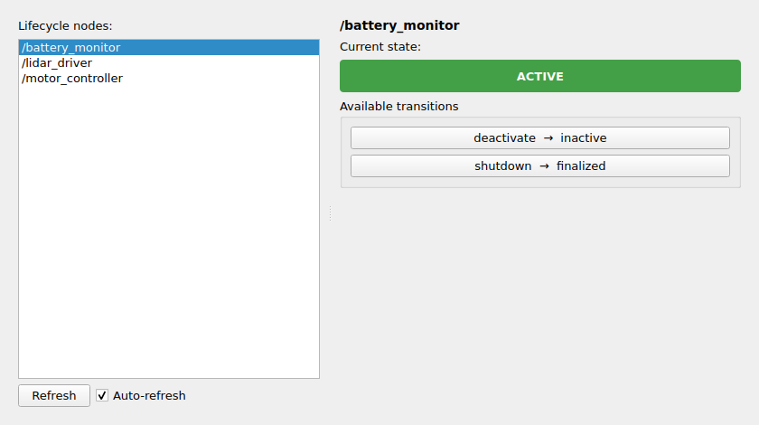

# rqt_lifecycle_manager


[](https://github.com/ajtudela/rqt_lifecycle_manager/actions/workflows/build.yml)
[](https://codecov.io/gh/ajtudela/rqt_lifecycle_manager)

## Overview

`rqt_lifecycle_manager` is an [rqt] plugin to **inspect and control ROS 2 lifecycle nodes** from a graphical interface. It lets you:

- **List all lifecycle nodes** currently present on the graph (auto-discovered).
- **See the current state** of the selected node, color-coded.
- **Change to any available state** through dynamically generated buttons (only valid transitions for the current state are shown).

The interface **never blocks**: every ROS 2 service call is issued asynchronously and its result is delivered back to the Qt GUI thread through signals, so the window stays responsive even if a node is slow to transition or does not answer at all.



**Keywords:** ROS2, rqt, lifecycle, lifecycle_msgs, state machine, GUI

**Author: Alberto Tudela<br />**

The package has been tested under [ROS2] Jazzy on [Ubuntu] 24.04. This is research code, expect that it changes often and any fitness for a particular purpose is disclaimed.

## How it works

ROS 2 lifecycle nodes expose their [managed state machine][lifecycle] through three services: `~/get_state`, `~/get_available_transitions` and `~/change_state`. This plugin:

1. **Discovers** lifecycle nodes with a fast, local graph query (`get_service_names_and_types`), filtering for nodes that offer a `~/get_state` service of type `lifecycle_msgs/srv/GetState`.
2. **Queries** the selected node's state and available transitions.
3. **Requests** a transition when you press a button.

All service calls use `call_async`. The plugin reuses the ROS 2 node that `rqt_gui_py` already spins in a background executor thread, so responses are processed off the GUI thread and marshaled back with Qt signals. The result is a **non-blocking** UI by design.

## Installation

### Building from Source

#### Dependencies

- [Robot Operating System (ROS) 2](https://docs.ros.org/en/jazzy/) (middleware for robotics)
- `rqt_gui`, `rqt_gui_py`, `python_qt_binding` (rqt framework)
- `lifecycle_msgs` (lifecycle service and message types)

#### Building

To build from source, clone the latest version from this repository into your colcon workspace and compile the package using:

```bash
cd colcon_workspace/src
git clone https://github.com/ajtudela/rqt_lifecycle_manager.git
cd ../
rosdep install -i --from-path src --rosdistro jazzy -y
colcon build --symlink-install
```

## Usage

Source your workspace, then launch it in one of two ways.

Inside the generic rqt container (**Plugins → Lifecycle → Lifecycle Manager**):

```bash
rqt
```

Or as a standalone window:

```bash
ros2 run rqt_lifecycle_manager rqt_lifecycle_manager
```

### Trying it out

Bring up any lifecycle node, for example the demo talker:

```bash
ros2 run lifecycle_py lifecycle_talker   # or any of your lifecycle nodes
```

It will appear in the node list. Select it, and use the transition buttons (`configure`, `activate`, `deactivate`, `cleanup`, `shutdown`, …) to move it through its states. The state label updates automatically, even when the node is transitioned from another tool.

## Nodes

This package does not provide a runtime node; it provides an rqt plugin. The plugin acts as a **client** of the standard lifecycle services of every managed node:

#### Services called (per managed node)

* **`<node>/get_state`** (`lifecycle_msgs/srv/GetState`)
  Reads the current lifecycle state.

* **`<node>/get_available_transitions`** (`lifecycle_msgs/srv/GetAvailableTransitions`)
  Lists the transitions valid from the current state.

* **`<node>/change_state`** (`lifecycle_msgs/srv/ChangeState`)
  Triggers a lifecycle transition.

[Ubuntu]: https://ubuntu.com/
[ROS2]: https://docs.ros.org/en/jazzy/
[rqt]: https://docs.ros.org/en/jazzy/Concepts/Intermediate/About-RQt.html
[lifecycle]: https://design.ros2.org/articles/node_lifecycle.html
